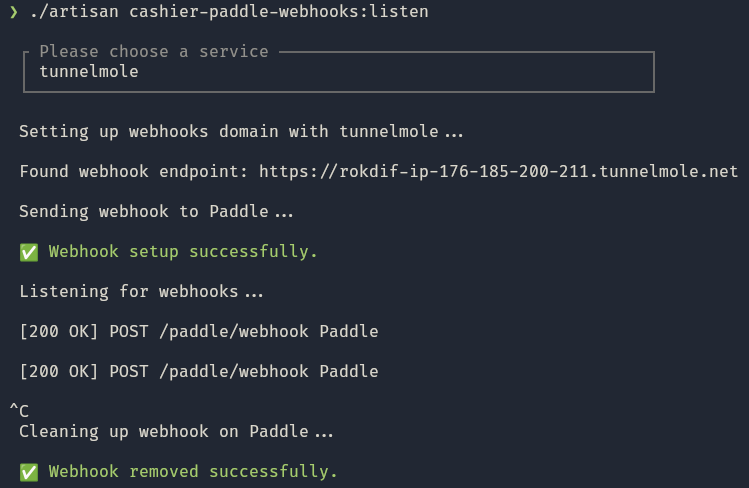
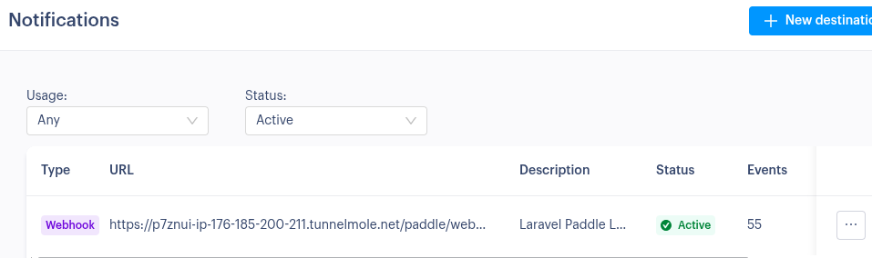

## cashier-paddle-webhooks

### A package to automatically listen to Paddle Webhooks in local development with Laravel Cashier

[](https://packagist.org/packages/einenlum/cashier-paddle-webhooks)
[](https://github.com/einenlum/cashier-paddle-webhooks/actions?query=workflow%3Arun-tests+branch%3Amain)
[](https://github.com/einenlum/cashier-paddle-webhooks/actions?query=workflow%3A"Fix+PHP+code+style+issues"+branch%3Amain)

This package allows you to setup Paddle webhooks locally in just one command, thanks to [tunnelmole](https://tunnelmole.com/). When the command is killed, it removes the webhook from Paddle. The library only works in *sandbox* mode.





This is **heavily** inspired from this [awesome command](https://github.com/lmsqueezy/laravel/blob/main/src/Console/ListenCommand.php) made by the LemonSqueezy team for their [Laravel package](https://github.com/lmsqueezy/laravel). Kudo to them! :heart:

The difference with the original package is that Paddle doesn't allow to create a webhook with a specific webhook secret. It's automatically generated by Paddle (on the contrary to LemonSqueezy). This means I had to add a few steps to make it work.

This library relies on **cache** to temporarily override the webhook secret.

## Requirements

- `laravel/cashier-paddle:^2.6`
- `tunnelmole` (see instructions [here](https://tunnelmole.com/))

This library does **not** work on Windows (because of signal handling).

You will also need to setup at least these envs:

```
PADDLE_SANDBOX=true
PADDLE_API_KEY=<your-api-key>
```

## Installation

```bash
composer require einenlum/cashier-paddle-webhooks
```

You should then add this in your `AppServiceProvider`:

```php
use Laravel\Paddle\Cashier;

public function register()
{
    // ...
    Cashier::ignoreRoutes();
}
```

This must be done in the **register** method and not the **boot** one. See [here](https://github.com/laravel/cashier-stripe/issues/1739).

This will allow the package to override the `webhook` page that is declared by [Cashier Paddle](https://laravel.com/docs/12.x/cashier-paddle). We must override it to use our Middleware instead of Cashier's one, because we need to get the Webhook secret from the cache if it exists.

You can publish the config file with:

```bash
php artisan vendor:publish --tag="cashier-paddle-webhooks-config"
```

This is the contents of the published config file:

```php
return [
    // Key used to store the Paddle webhook secret in the cache.
    'cache_key' => 'cashier-paddle-webhooks.secret',

    // Default is config('cashier.pash').'/webhook' if null
    // but you can override it here.
    'webhook_path' => null,

    /*
     * Whether to automatically register the webhook route
     * from this package.
     *
     * Check the documentation as to why it is enabled by default.
     *
     * If you disable this, you will have to take care yourself
     * of overriding the default Cashier Paddle middleware.
     *
     * @see VerifyPaddleWebhookMiddleware
     */
    'register_routes' => true,

    'subscribed_events' => [
        // Transaction events
        'transaction.billed',
        'transaction.canceled',
        'transaction.completed',
        'transaction.created',
        'transaction.paid',
        'transaction.past_due',
        'transaction.payment_failed',
        'transaction.ready',
        'transaction.updated',
        'transaction.revised',

        // Subscription events
        'subscription.activated',
        'subscription.canceled',
        'subscription.created',
        'subscription.imported',
        'subscription.past_due',
        'subscription.paused',
        'subscription.resumed',
        'subscription.trialing',
        'subscription.updated',

        // Product events
        'product.created',
        'product.imported',
        'product.updated',

        // Price events
        'price.created',
        'price.imported',
        'price.updated',

        // Customer events
        'customer.created',
        'customer.imported',
        'customer.updated',

        // Payment method events
        'payment_method.saved',
        'payment_method.deleted',

        // Address events
        'address.created',
        'address.imported',
        'address.updated',

        // Business events
        'business.created',
        'business.imported',
        'business.updated',

        // Adjustment events
        'adjustment.created',
        'adjustment.updated',

        // Payout events
        'payout.created',
        'payout.paid',

        // Discount events
        'discount.created',
        'discount.imported',
        'discount.updated',

        // Discount group events
        'discount_group.created',
        'discount_group.updated',

        // Report events
        'report.created',
        'report.updated',

        // API key events
        'api_key.created',
        'api_key.expired',
        'api_key.expiring',
        'api_key.revoked',
        'api_key.updated',

        // Client token events
        'client_token.created',
        'client_token.updated',
        'client_token.revoked',
    ],
];
```

## Usage

```php
php artisan cashier-paddle-webhooks:listen
```

This will create a tunnel thanks to `tunnelmole` which listens to `http://localhost:8000`, create a webhook on Paddle sandbox, fetch its id and secret, and set the secret into cache (whatever your cache setup is). When the command is killed, it removes the webhook from Paddle and removes the key from the cache.

Then in the [VerifyPaddleWebhookMiddleware](src/Http/Middlewares/VerifyPaddleWebhookMiddleware.php), the cached secret key is used if it exists and if you are not in production.

You can change the port with

```php
php artisan cashier-paddle-webhooks:listen --port 1234
```

## Testing

```bash
composer test
```

## Changelog

Please see [CHANGELOG](CHANGELOG.md) for more information on what has changed recently.

## Credits

- [Dries Vints](https://github.com/driesvints) for his great library [lmsqueezy/laravel](https://github.com/lmsqueezy/laravel)
- [Spatie](https://spatie.be/) team for creating the [spatie/package-skeleton-laravel](https://github.com/spatie/package-skeleton-laravel) template

## Other projects of mine

- [human-replay](https://github.com/Einenlum/human-replay): Make text appear exactly how you typed it. Copy paste a few JS lines.
- [tailwind-alchemist](https://github.com/Einenlum/tailwind-alchemist): A CLI tool to find and replace Tailwind CSS colors 🪄
- [yaml-revealer](https://github.com/Einenlum/yaml-revealer): A vim plugin to easily navigate through Yaml files

## License

The MIT License (MIT). Please see [License File](LICENSE.md) for more information.
